# Завдання варіанту 20

## Умова

Вивчення впливу магнітного поля на роботу побутових пристроїв. Потрібно виміряти рівень магнітного поля поблизу різних побутових пристроїв, таких як комп'ютери, телевізори, мікрохвильові печі, і оцінити їхній вплив на інші пристрої. Обробка даних включає порівняння рівнів магнітного поля та виявлення взаємозв'язків.

## Виконання

### [Код програми](pw6_20.py)

### Початок роботи: збір даних та написання допоміжної програми

Для того аби виконати порівняння магнітних полів спочатку необхідно зробити виміри. Для вимірювання даних магнітних полів різних пристроїв я використав мобільний застосунок Phyphox? який має багато інструментів, в тому числі потрібний мені магнітометр.
Після випірювання та експортування даних було написано програму для виведення та порівняння отриманих даних у вигляді графіків. Спочатку поглянемо на значення магнітних полів посеред кухні (рис. 1), залу (рис. 2) та спальної кімнати (рис. 3).

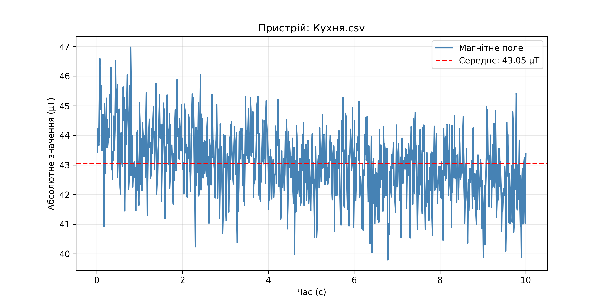

 Рисунок 1 - Магнітне поле на кухні

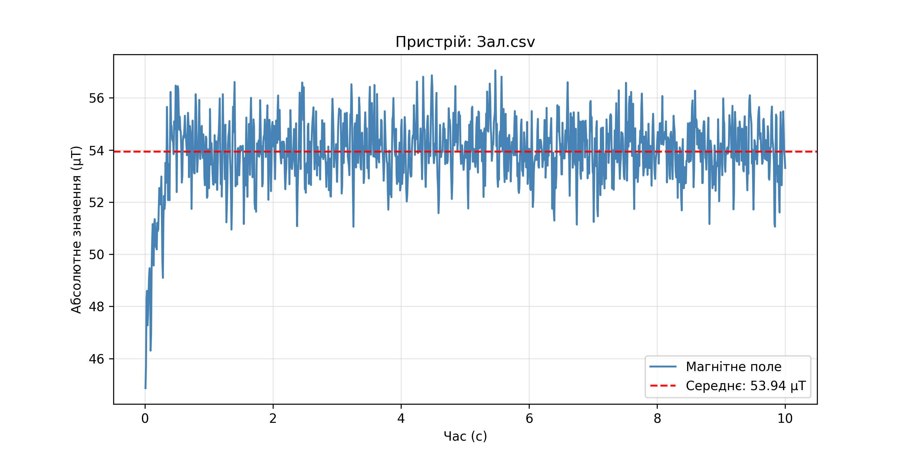

 Рисунок 2 - Магнітне поле в залі

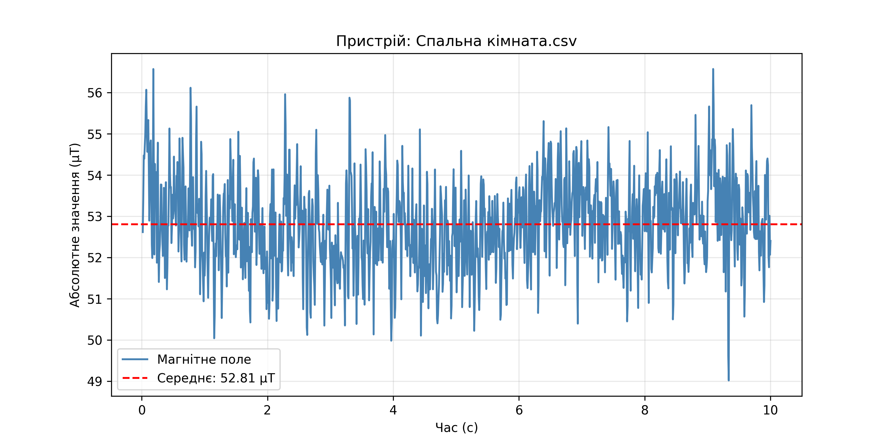

 Рисунок 3 - Магнітне поле в спальній кімнаті

Як ми бачимо середнє значеннямагнітного поля посеред кімнати становить 43-53 мікротесл.

Тепер розглянемо магнітні поля конкретних приладів, а саме мікрохвильової печі до та після запуску (кімната: кухня; рис. 4) та ПК (кімната: спальна; рис. 5). Також можемо розглянути порівняльний графік на якому видно, наскільки магнітні поля цих приладів вищі за значення посеред кімнат (рис. 6).

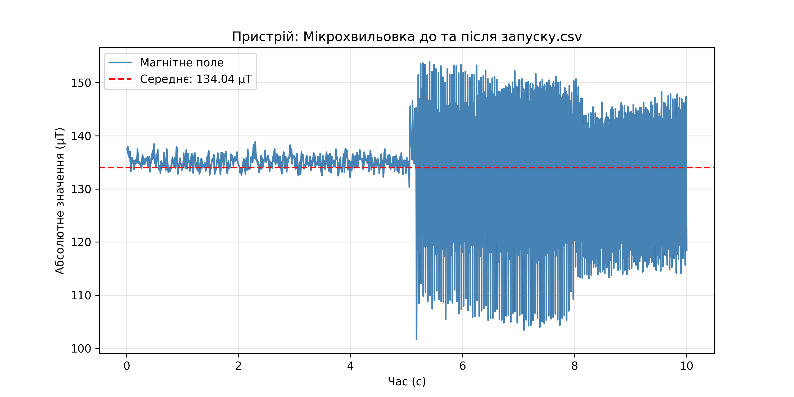

 Рисунок 4 - Магнітне поле мікрохвильової печі

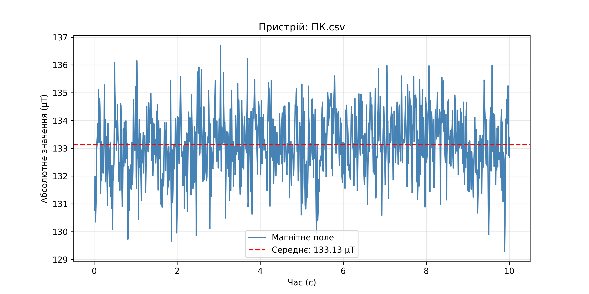

 Рисунок 5 - Магнітне поле персонального комп'ютера

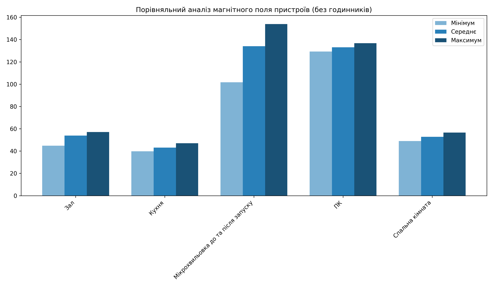

 Рисунок 6 - Порівняння розглянутих магнітних полів

Як ми бачимо, рівні магнітних полів мікрохвильовки та ПК значно більший за "стандартний" в кімнатах, тому ці прилади можуть мати вплив на інші прилади.

### Вплив магнітних полів на прилади

Найлегшим способ перевірити, чи можуть магнітні поля від ПК та мікрохвильовки впливати на інші прилади, це використати компас.

На рисунку 7 зображено скриншот компасу посеред спальної кімнати (правдивий напрям), а на рисунку 8 - скриншот компасу, коли телефон лежав на ПК. Як ми бачимо, магнітне поле ПК збиває компас, оскільки поле впливає на датчики телефону (в обох випадках телефон повернутий однаково відносно сторін світу). Важливо уточнити, що на телефоні компас та магнітометр використовують одні і ті ж датчики.

  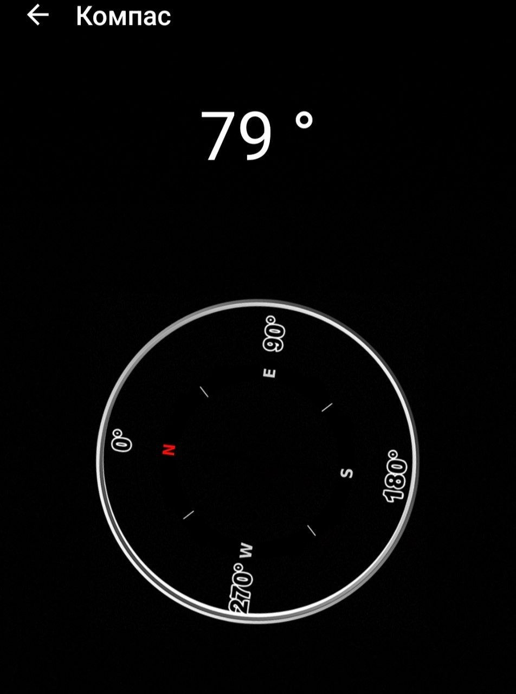

 Рисунок 7 - Норма компасу в спальній кімнаті

  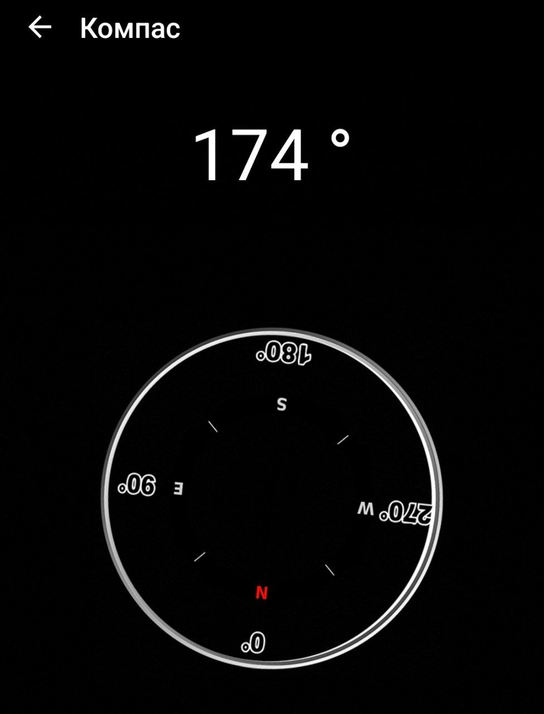

 Рисунок 8 - Компас під впливом магнітного поля ПК

Аналогічний дослід проведене з мікрохвильовкою. Рисунок 9 - це істинний напрям півночі, а рисунок 10 - коли телефон був біля НЕ працюючої мікрохвильовки. Під час дослідів також було помічено, що під час роботи мчкрохвильовки компас плавно обертався за годинниковою стрілкою. Це є наслідком програмної дезорієнтації цифрового датчика — магнітометра. Телефон вимірює проєкції магнітного поля по трьох осях за допомогою мікросхем на основі ефекту Холла, після чого алгоритми перетворюють ці дані на вектор, що вказує на Північ. Під час роботи мікрохвильовки виникає потужне змінне магнітне поле частотою 50 Гц, яке значно перевищує за силою поле Землі та змушує датчик постійно фіксувати хаотичні зміни значень. Оскільки застосунки мають вбудовані фільтри для плавного відображення руху, вони не можуть миттєво відреагувати на таку високу частоту коливань і намагаються математично «згладити» отриманий хаос. Це призводить до дрейфу обчисленого вектора, що інтерпретується програмою як зміна орієнтації пристрою в просторі та візуалізується у вигляді плавного обертання стрілки на екрані.

  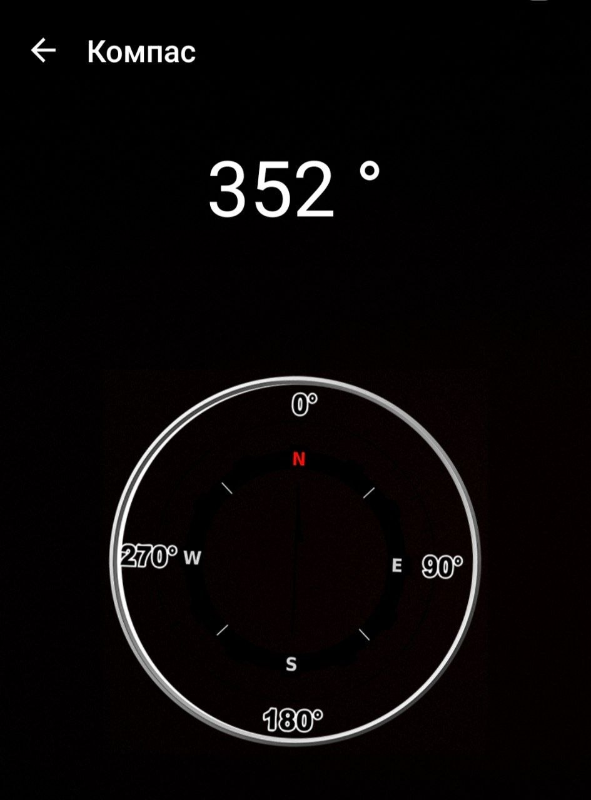

  

 Рисунок 9 - Норма компасу на кухні

  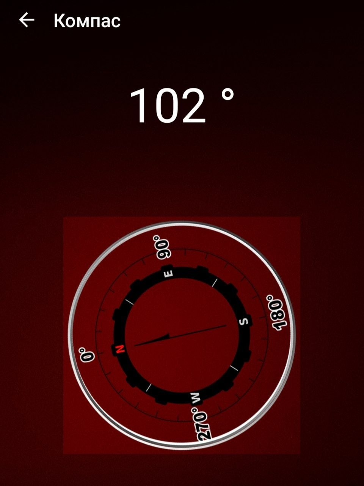

 Рисунок 10 - Компас під впливом магнітного поля не працюйочої мікрохвильовки

### Інші цікаві спостереження

За час проживання в квартирі була помічена одна цікава річ. На кухні висів настінний годинник, який згодом перестав йти. Заміна батарейок не допомогла. Ну, подумали, буває різне. Купили нові, повісили на те ж місце, і через певний час вони перестали йти. Заміна батарейок знову не допомога. Не розуміючи у чому справа, вирішили взяти магніт. Він прилип до стіни там, де висіли годинники. В інших точках стіни він відпадає. Згодом, втсановивши магнітометр, ми побачили одну цікаву річ - магнітне поче дуже високе (рис. 11). Хтось скаже що це може бути дріт, проте ні - магнітне поле не йде горизонтально чи вертикально - воно точкове. Причина досі не відома, проте є теоря, що в стіні проходить арматура, яка отримала намагнітилась від дрота, який проходить поруч в стіні(але глибоко для магнітометра), і в результаті арматура має власне магнітне поле. Важливо уточнити, що сам по собі годинним не повністю електронний. Він має механічні стрілки.

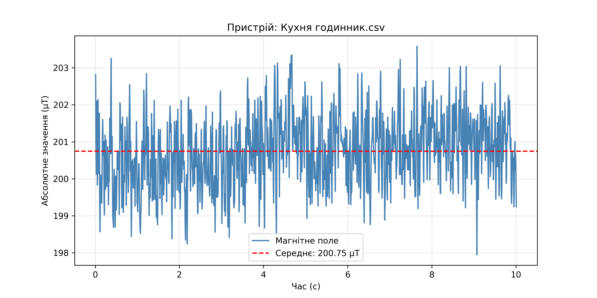

 Рисунок 11 - Магнітне поле в місці, де висів годинник

Ще одна цікава ситуація помічена вже в іншій кімнаті - залі. В цій кімнаті на стіні висить телевізор, а під ним стоїть вже повністю електронний(цифровий) годинник. Було помічено, що з часом годинним починає відсавати від фактичного часу. Після вимірювання магнітного поля в місці, де стоїть годинник (рис. 12) виявилос, що годинник знаходиться дуже близько до динаміків телевізора, а динаміки мають сильне магнітне поле. Є припущення, що саме це спричиняє відставання годинника.

.png)

 Рисунок 12 - Магнітне поле в місці, де стоїть цифровий годинник

До речі, якщо ви звернули увагу, то на рисунку 12 графік йде ніби великими хвилями. Помітивши це, я вирішив збільшити тривалість запису з 10 до 30 секунд, і отримав наступне:

.png)

 Рисунок 13 - Магнітне поле в мцсці, де стоїть цифровий годинник (збільшена тривалість запису)

Поява таких коливань магнітного поля поблизу телевізора пояснюється динамічною зміною електромагнітного фону, що генерується внутрішніми вузлами працюючої техніки. Оскільки телефон знаходився в стані спокою (лежить на одном місці), циклічні коливання значень індукції зумовлені не механічним переміщенням, а процесами всередині самого телевізора: зміною потужності підсвічування екрана та роботою імпульсного блока живлення, який адаптує споживання струму залежно від яскравості зображення. На отриманий результат також суттєво впливає ефект аліасингу (накладання частот), що виникає при цифровій обробці сигналу: коли частота, з якою датчик смартфона опитує середовище, вступає в резонанс із 50-герцовою пульсацією електромережі, на графіку з'являються низькочастотні математичні артефакти у вигляді плавних хвиль.

## Висновок

Під час виконання цієї роботи я провів дослідження магнітного поля таких приладів як ПК та мікрохвильовка з використання програми Phyphox та власноруч написаної програми дял візуалізації графіків та порівняння результатів. Проаналізував те, як магнітні поля зазначених приладів впливають на інші прилади (компас). Також було проаналізовано виявлені проблеми з годинниками, що спричинені потужними магнітними полями.
